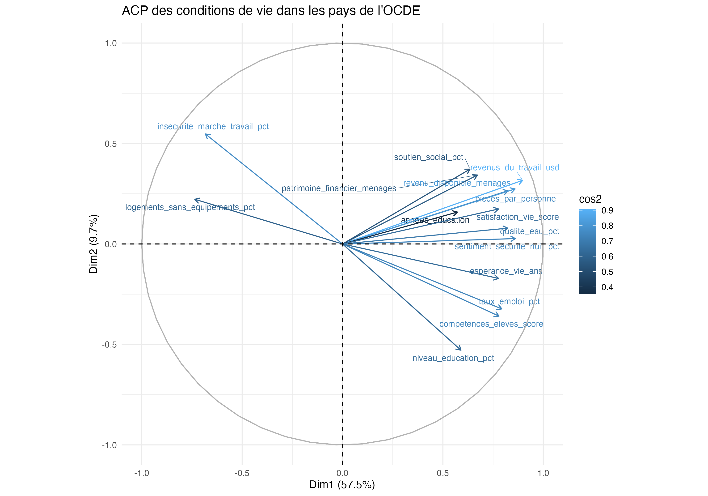
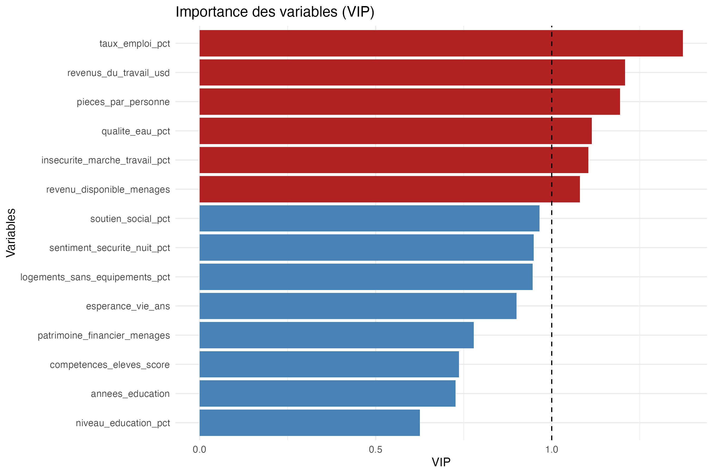
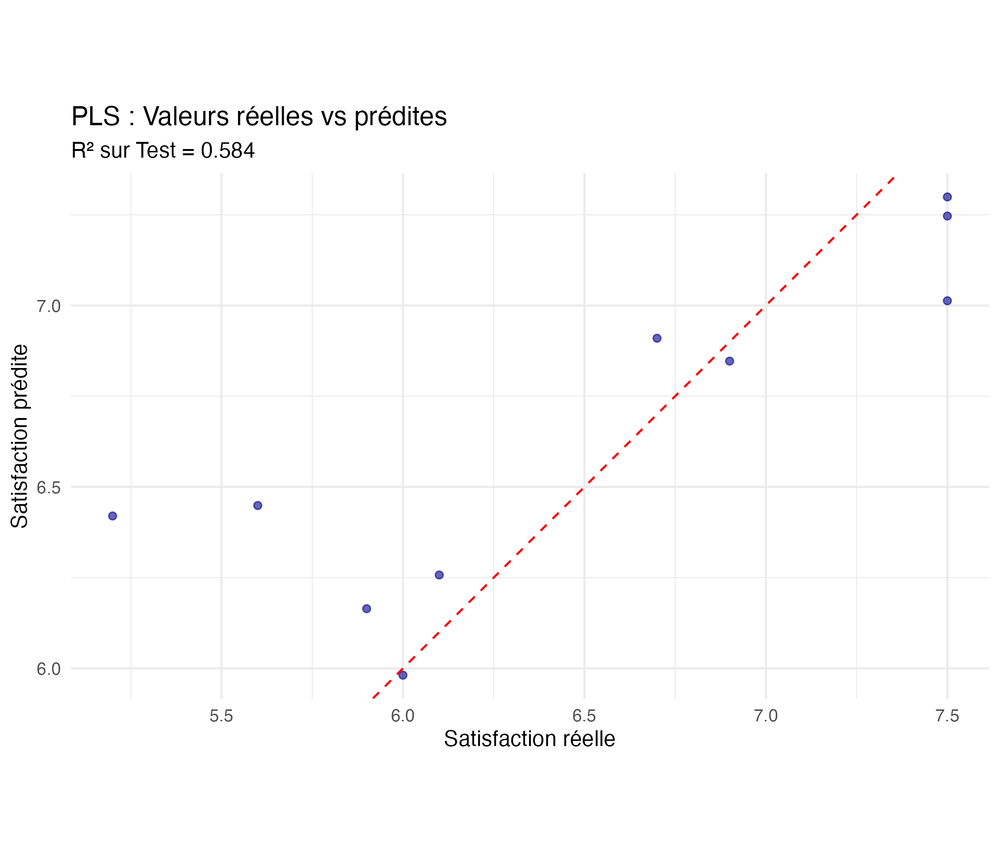

# Analyse des conditions de vie dans les pays de l'OCDE

Projet réalisé dans le cadre du cours de modélisation avec des variables latentes, par Véronique Cariou en Master 1 Économétrie Appliquée à l'IAE Nantes.

L'objectif est d'analyser les principales dimensions associées aux conditions de vie dans les pays de l'OCDE et d'étudier la capacité de différentes méthodes de réduction de dimension à modéliser et prédire la satisfaction dans la vie.

## Objectif

Les indicateurs de conditions de vie couvrent de nombreuses dimensions : revenu, emploi, logement, éducation, santé, environnement ou encore sécurité.

L'étude vise à :

- explorer les relations entre ces différents indicateurs ;
- synthétiser l'information à l'aide de méthodes de réduction de dimension ;
- identifier les principales dimensions structurant les différences entre pays ;
- modéliser la satisfaction dans la vie ;
- comparer les performances prédictives de plusieurs approches.

## Données

L'analyse porte sur **38 pays de l'OCDE** et s'appuie sur **22 indicateurs** relatifs aux conditions de vie.

Les variables couvrent notamment :

- les revenus et le patrimoine ;
- l'emploi et le marché du travail ;
- les conditions de logement ;
- l'éducation et les compétences ;
- la santé ;
- la qualité de l'environnement ;
- le soutien social et la sécurité ;
- la satisfaction dans la vie.

La base utilisée pour l'analyse est disponible dans le dossier `data/`.

## Méthodologie

### Analyse en composantes principales

Une **Analyse en Composantes Principales (ACP)** est d'abord utilisée pour synthétiser l'information contenue dans les indicateurs fortement corrélés.

Après étude de la qualité de représentation et de la contribution des variables, **15 variables** sont retenues pour l'ACP.

Le premier axe explique environ **57,5 % de la variance**, tandis que les quatre premiers axes permettent d'en expliquer environ **81,2 %**.

Le premier axe peut notamment être interprété comme une dimension générale des conditions de vie, associant revenu, emploi, éducation, santé et qualité de l'environnement.



### Modélisation de la satisfaction dans la vie

Les données sont séparées en un échantillon d'apprentissage (**70 %**) et un échantillon test (**30 %**) afin d'évaluer les performances prédictives sur des observations non utilisées lors de l'estimation.

Trois approches sont comparées :

- régression linéaire multiple ;
- régression sur composantes principales (**PCR**) ;
- régression Partial Least Squares (**PLS**).

Le nombre de composantes est sélectionné par validation croisée.

## Résultats

La réduction de dimension améliore nettement les performances par rapport à la régression linéaire classique.

| Modèle | Nombre de composantes | R² test | RMSE test |
|---|---:|---:|---:|
| Régression linéaire | — | 0,104 | 0,761 |
| PCR | 1 | 0,563 | 0,532 |
| PLS | 1 | **0,584** | **0,519** |

Parmi les modèles comparés, la **PLS à une composante** obtient le R² test le plus élevé et le RMSE test le plus faible.

### Importance des variables

L'analyse des **VIP (Variable Importance in Projection)** permet d'identifier les variables jouant le rôle le plus important dans la prédiction de la satisfaction dans la vie.

Parmi les variables qui ressortent figurent notamment le taux d'emploi, les revenus du travail, le revenu disponible des ménages, le nombre de pièces par personne, la qualité de l'eau et l'insécurité du marché du travail.



### Valeurs réelles et prédites

Le modèle PLS reproduit correctement la tendance générale de la satisfaction dans la vie sur l'échantillon test, avec un **R² de 0,584**.



## Méthodes utilisées

- Analyse exploratoire des données
- Analyse en Composantes Principales (ACP)
- Régression linéaire multiple
- Principal Component Regression (PCR)
- Partial Least Squares Regression (PLS)
- Validation croisée
- Séparation apprentissage / test
- Analyse des VIP
- Évaluation prédictive par R² et RMSE

## Technologies

**Langage :** R

**Manipulation et visualisation :**
- `tidyverse`
- `dplyr`
- `tidyr`
- `ggplot2`
- `corrplot`
- `factoextra`

**Analyse statistique et modélisation :**
- `FactoMineR`
- `psych`
- `caret`
- `pls`
- `EnvStats`
- `outliers`

**Reporting :**
- Quarto
- `knitr`
- `kableExtra`

## Structure du dépôt

```text
conditions-vie-ocde/
├── README.md
├── code/
│   └── analyse_conditions_vie_ocde.qmd
├── data/
│   └── base_OECD_clean.csv
├── figures/
│   ├── acp_cercle_correlations.png
│   ├── importance_variables_pls.png
│   └── predictions_pls.png
├── rapport/
│   └── rapport.pdf
└── conditions-vie-ocde.Rproj
```

## Rapport

Le rapport complet de l'étude est disponible ici :

[Consulter le rapport](rapport/rapport.pdf)

## Auteurs

- **Amélie Pires**
- Ikram Abouzayd
  
Master 1 Économétrie Appliquée — Modélisation avec des variables latentes — IAE Nantes, 2025-2026

## Contact

**Amélie Pires**

Mail : [amelie.pires@hotmail.com](mailto:amelie.pires@hotmail.com) · [LinkedIn](https://www.linkedin.com/in/amelie-pires) · [GitHub](https://github.com/aps-18)
